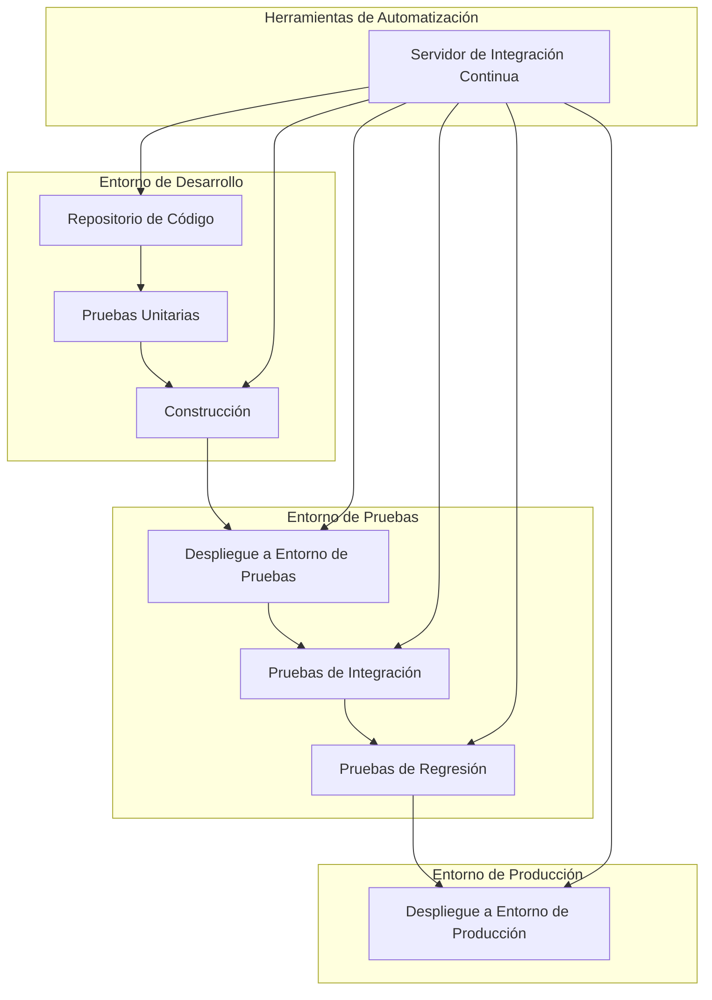

El principio "Automate Your Environment" se refiere a la automatización de tareas y procesos en el entorno de desarrollo, implementación y operaciones de sistemas de software. El objetivo es minimizar el trabajo manual repetitivo y propenso a errores, y maximizar la eficiencia y la consistencia en todas las etapas del ciclo de vida de un sistema.

Automatizar el entorno tiene varios beneficios, entre ellos:

1. Eficiencia y productividad: La automatización reduce la necesidad de realizar tareas manuales, lo que ahorra tiempo y esfuerzo. Las tareas que solían llevar horas o días pueden completarse en minutos o segundos, lo que permite una entrega más rápida y una mayor capacidad de respuesta a los cambios.

2. Consistencia: La automatización garantiza que los procesos se realicen de manera coherente y estandarizada en todo el entorno. Esto reduce los errores humanos y mejora la calidad y fiabilidad del sistema.

3. Reproducibilidad: Al automatizar el entorno, se puede capturar y documentar el proceso en forma de código o scripts. Esto permite reproducir el entorno de manera exacta en diferentes etapas, como desarrollo, pruebas o producción, lo que facilita la colaboración y la solución de problemas.

4. Escalabilidad: La automatización facilita la escalabilidad al permitir la gestión eficiente de recursos, como la creación y configuración automatizada de máquinas virtuales o contenedores. Esto es especialmente importante en entornos en la nube, donde los recursos se pueden escalar horizontal o verticalmente según sea necesario.

5. Seguridad y cumplimiento: La automatización puede ayudar a aplicar políticas de seguridad y cumplimiento de manera consistente en todo el entorno. Por ejemplo, se pueden implementar escaneos de seguridad automatizados, configuraciones de red seguras y aplicar parches de software de manera oportuna.

Para aplicar el principio "Automate Your Environment", aquí hay algunas recomendaciones:

1. Utiliza herramientas de automatización: Existen numerosas herramientas y frameworks que permiten la automatización de tareas y procesos, como Ansible, Puppet, Chef, Docker, Kubernetes, Jenkins, entre otros. Investiga y elige las herramientas más adecuadas para tu entorno y requisitos específicos.

2. Automatiza la infraestructura: Utiliza herramientas de infraestructura como código (IaC) para describir y aprovisionar la infraestructura en forma de código. Esto te permite crear y gestionar tu infraestructura de manera programática, evitando configuraciones manuales propensas a errores.

3. Implementa la integración y entrega continua (CI/CD): Automatiza el proceso de construcción, pruebas y despliegue de software utilizando pipelines de CI/CD. Esto te permite realizar entregas rápidas y frecuentes, manteniendo una alta calidad y minimizando los errores.

4. Automatiza las pruebas: Implementa pruebas automatizadas, como pruebas unitarias, pruebas de integración y pruebas de rendimiento. Esto te ayuda a identificar problemas de manera temprana y asegurar la calidad del software de manera continua.

5. Monitoriza y gestiona de forma automatizada: Utiliza herramientas de monitoreo y gestión automatizada para supervisar el rendimiento del sistema, detectar anomalías y aplicar ajustes automáticos cuando sea necesario.

6. Documenta y comparte: Asegúrate de documentar y compartir los procesos y scripts de automatización. Esto facilita la colaboración, el mantenimiento y la transferencia de conocimiento dentro del equipo.

Recuerda que la automatización no se limita solo al entorno de desarrollo, sino que puede aplicarse a otras áreas, como la configuración de redes, el aprovisionamiento de recursos en la nube, la gestión de bases de datos, la seguridad, entre otros. La clave es identificar las tareas repetitivas y propensas a errores y buscar oportunidades para automatizarlas, mejorando así la eficiencia y la confiabilidad de tu entorno.

## Recomendaciones

Aquí tienes algunas recomendaciones para aplicar el principio "Automate Your Environment" de manera efectiva:

1. Identifica las tareas adecuadas para la automatización: Analiza las tareas repetitivas, propensas a errores o que consumen mucho tiempo en tu entorno. Estas tareas son buenos candidatos para la automatización. Esto puede incluir la configuración de infraestructura, la implementación de software, la gestión de configuraciones, las pruebas, el monitoreo, entre otros.

2. Establece objetivos claros: Define los objetivos específicos que deseas lograr con la automatización. Estos pueden incluir aumentar la eficiencia, reducir los errores, mejorar la velocidad de entrega, garantizar la consistencia, mejorar la escalabilidad, entre otros. Establecer objetivos claros te ayudará a enfocar tus esfuerzos y evaluar el éxito de la automatización.

3. Selecciona las herramientas adecuadas: Investiga y selecciona las herramientas de automatización más adecuadas para tus necesidades. Hay una amplia gama de herramientas disponibles para diferentes áreas, como infraestructura, gestión de configuraciones, integración y entrega continua, pruebas, monitoreo, etc. Asegúrate de elegir las herramientas que se integren bien con tu entorno y que sean fáciles de usar y mantener.

4. Diseña procesos claros y bien definidos: Antes de automatizar una tarea, asegúrate de comprender completamente el proceso manual y documentarlo de manera clara. Identifica los pasos, las dependencias y los requisitos. Esto te ayudará a desarrollar una automatización efectiva y evitará problemas en el futuro.

5. Utiliza prácticas de infraestructura como código (IaC): Adopta el enfoque de infraestructura como código para automatizar la creación y configuración de la infraestructura. Utiliza herramientas como Terraform, CloudFormation o Ansible para describir tu infraestructura en archivos de código que se puedan gestionar y versionar.

6. Implementa pipelines de integración y entrega continua (CI/CD): Automatiza el proceso de construcción, pruebas y despliegue de tu software utilizando pipelines de CI/CD. Esto te permite entregar cambios de manera rápida y confiable, al tiempo que garantiza la calidad y la consistencia.

7. Documenta y comparte el conocimiento: Asegúrate de documentar los procesos automatizados, los scripts y las configuraciones. Mantén una documentación actualizada que explique cómo funcionan las automatizaciones, cómo se utilizan las herramientas y cualquier configuración específica. Esto facilitará la colaboración y el mantenimiento a largo plazo.

8. Realiza pruebas y validaciones regulares: Asegúrate de probar y validar las automatizaciones de manera regular. Esto incluye realizar pruebas de integración, pruebas de extremo a extremo y pruebas de rendimiento para garantizar que las automatizaciones funcionen según lo esperado y sigan siendo efectivas a medida que evoluciona tu entorno.

Recuerda que la automatización es un proceso continuo. Debes estar dispuesto a iterar y mejorar constantemente tus automatizaciones a medida que evoluciona tu entorno y surgen nuevas necesidades.

## Ejemplo

Ejemplo de diagrama para ilustrar la automatización de un proceso de implementación continua (CI/CD):

En este ejemplo, el proceso de implementación continua (CI/CD) se automatiza utilizando diferentes herramientas y entornos. Aquí hay una descripción de cada componente:

- El "Repositorio de Código" almacena el código fuente de la aplicación.
- Las "Pruebas Unitarias" se ejecutan en el entorno de desarrollo para verificar la funcionalidad de componentes individuales.
- La "Construcción" del software se realiza en el entorno de desarrollo, donde se generan los artefactos de implementación.
- Los artefactos se despliegan en el "Entorno de Pruebas" para realizar "Pruebas de Integración" y "Pruebas de Regresión" que validan el comportamiento y la interoperabilidad del sistema.
- Finalmente, si todas las pruebas son exitosas, los artefactos se despliegan en el "Entorno de Producción" para su uso en producción.

La automatización de este proceso se logra mediante el uso de un "Servidor de Integración Continua" que se encarga de coordinar y ejecutar las diferentes etapas del CI/CD. Este servidor está conectado a cada etapa del proceso, desde la construcción hasta las pruebas y el despliegue, permitiendo la automatización y orquestación de todo el flujo de trabajo.

Este es solo un ejemplo básico de cómo se puede utilizar Mermaid para representar visualmente la automatización de un proceso de CI/CD. Recuerda que puedes personalizar y ampliar este diagrama para adaptarlo a tus propias herramientas y flujos de trabajo de automatización.