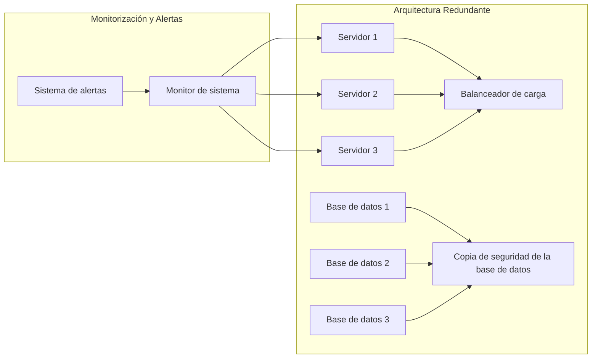

El principio "Avoid Single Point of Failure" se refiere a diseñar y configurar sistemas de manera que no exista un solo punto de fallo que pueda provocar una interrupción total del servicio. Se busca garantizar la disponibilidad y la tolerancia a fallos del sistema, asegurando que la caída de un componente o recurso no afecte la funcionalidad general del sistema.

Al evitar los puntos de fallo únicos, se logra mejorar la resiliencia y la confiabilidad del sistema en general. Aquí hay algunas consideraciones y recomendaciones para aplicar este principio:

1. Arquitectura de alta disponibilidad: Diseña la arquitectura del sistema de manera que haya redundancia en los componentes críticos. Esto implica la utilización de múltiples instancias, servidores, servicios o componentes que puedan asumir la carga y funcionar como respaldo en caso de falla.

2. Distribución geográfica: Si es posible, distribuye tus recursos y servicios en diferentes ubicaciones geográficas. Esto proporciona una mayor resistencia ante eventos adversos locales, como fallas de energía, desastres naturales o interrupciones en una región específica.

3. Balanceo de carga: Utiliza un equilibrador de carga para distribuir el tráfico de manera uniforme entre múltiples instancias o servidores. Esto asegura que ningún componente esté sobrecargado y ayuda a evitar un único punto de fallo debido a la saturación de recursos.

4. Replicación de datos: Implementa la replicación de datos en tiempo real para garantizar la disponibilidad y la integridad de la información. Al replicar los datos en múltiples ubicaciones, se evita que la pérdida de un único servidor o ubicación cause la pérdida completa de los datos.

5. Monitoreo y gestión proactiva: Establece un sistema de monitoreo y alertas para detectar y responder rápidamente a posibles puntos de fallo. Esto permite tomar medidas preventivas y realizar intervenciones tempranas antes de que los problemas se conviertan en fallas críticas.

6. Pruebas de tolerancia a fallos: Realiza pruebas y simulaciones para evaluar la capacidad del sistema para resistir fallos y recuperarse de ellos. Esto puede incluir pruebas de conmutación por error, pruebas de recuperación ante desastres y pruebas de carga extrema para evaluar los límites y la estabilidad del sistema.

7. Implementa sistemas de respaldo y recuperación: Establece mecanismos de respaldo y recuperación para asegurar la continuidad del servicio en caso de fallo. Esto puede incluir la configuración de copias de seguridad regulares, la implementación de sistemas de recuperación ante desastres y la planificación de procesos de restauración.

Al seguir estos principios y recomendaciones, puedes minimizar la posibilidad de que un único punto de fallo cause interrupciones significativas en tu sistema. La arquitectura resistente y la planificación adecuada ayudarán a garantizar la disponibilidad y la continuidad del servicio incluso en situaciones adversas.

## Recomendaciones
Aquí tienes algunas recomendaciones para aplicar el principio "Avoid Single Point of Failure" en tu arquitectura:

1. Identifica y analiza los puntos de fallo potenciales: Realiza un análisis exhaustivo de tu arquitectura y identifica los componentes críticos que podrían convertirse en puntos de fallo. Estos podrían incluir servidores, servicios, redes, bases de datos u otros elementos clave.

2. Diseña una arquitectura resiliente: Busca diseñar una arquitectura que incorpore redundancia en los componentes críticos. Esto implica tener múltiples instancias o servidores que puedan asumir la carga y funcionar como respaldo en caso de fallo. Utiliza configuraciones de alta disponibilidad y enfoques de tolerancia a fallos, como clústeres, réplicas o zonas de disponibilidad.

3. Establece políticas de escalado automático: Utiliza herramientas y servicios que permitan el escalado automático de tus recursos según la demanda. Esto ayuda a distribuir la carga y evita la saturación de un solo componente. Configura las políticas de escalado para aumentar o reducir automáticamente la capacidad según los umbrales de uso predefinidos.

4. Implementa balanceadores de carga: Utiliza un equilibrador de carga para distribuir el tráfico de manera uniforme entre tus componentes o servidores. Esto evita que un único componente se sobrecargue y se convierta en un punto de fallo. Los balanceadores de carga pueden detectar y redirigir el tráfico a componentes sanos en caso de fallo.

5. Utiliza almacenamiento y bases de datos redundantes: Implementa soluciones de almacenamiento y bases de datos que ofrezcan redundancia y replicación de datos. Utiliza sistemas de almacenamiento distribuido, como sistemas de archivos distribuidos o sistemas de almacenamiento en la nube con replicación automática. Configura réplicas de bases de datos para garantizar la disponibilidad de los datos incluso en caso de fallos.

6. Establece procesos de monitorización y alertas: Implementa un sistema de monitorización proactivo que supervise constantemente el estado de tus componentes y servicios. Configura alertas para notificar cualquier anomalía o degradación del sistema. Esto te permite identificar problemas potenciales antes de que se conviertan en fallos críticos y tomar medidas correctivas de manera oportuna.

7. Realiza pruebas y simulaciones de fallos: Realiza pruebas periódicas de tolerancia a fallos para evaluar la capacidad de tu arquitectura para resistir y recuperarse de fallos. Simula escenarios de fallos y evalúa cómo responde tu sistema. Ajusta y mejora tu arquitectura según los resultados de estas pruebas.

8. Planifica la recuperación ante desastres: Desarrolla un plan de recuperación ante desastres que incluya procesos y procedimientos claros para restaurar y recuperar tus sistemas en caso de una interrupción grave. Realiza copias de seguridad regulares y prueba la recuperación de los datos y la infraestructura.

Recuerda que la implementación exitosa de este principio requiere un enfoque integral y una consideración detallada de cada componente crítico en tu arquitectura. El objetivo es eliminar los puntos de fallo únicos y asegurar la continuidad del servicio incluso en situaciones de fallo.

## Ejemplo
¡Claro! Aquí tienes un ejemplo de diagrama utilizando la herramienta Mermaid para ilustrar un escenario en el que se aplica el principio "Avoid Single Point of Failure":

En este ejemplo, se muestra una arquitectura redundante y un sistema de monitorización y alertas para evitar un único punto de fallo. Aquí tienes una descripción de cada componente:

- "Arquitectura Redundante" representa una arquitectura en la que se utilizan múltiples servidores (Servidor 1, Servidor 2 y Servidor 3) que están equilibrados por un balanceador de carga (Balanceador de carga). Esto permite distribuir el tráfico y asegurar que si un servidor falla, otros servidores puedan asumir la carga sin interrupciones en el servicio.

- "Base de datos 1, Base de datos 2 y Base de datos 3" representan bases de datos que están replicadas y respaldadas por una copia de seguridad de la base de datos (Copia de seguridad de la base de datos). Si una base de datos falla, las otras bases de datos pueden continuar brindando el servicio, y la copia de seguridad de la base de datos se puede utilizar para restaurar rápidamente la base de datos fallida.

- "Monitor de sistema" representa un sistema de monitorización que supervisa constantemente el estado de los servidores. Está conectado a los servidores (Servidor 1, Servidor 2 y Servidor 3) y puede detectar cualquier problema o fallo en ellos.

- "Sistema de alertas" representa un sistema que recibe las notificaciones del monitor de sistema y emite alertas en caso de detectar anomalías o fallos. Esto permite una respuesta rápida y una intervención oportuna para evitar que los problemas se conviertan en fallos críticos.

Este diagrama muestra cómo se puede diseñar una arquitectura redundante y utilizar sistemas de monitorización y alertas para evitar un único punto de fallo en los servidores y las bases de datos. Mermaid proporciona una representación visual clara de este escenario, pero ten en cuenta que este es solo un ejemplo básico y puedes personalizar y expandir el diagrama según tus propias configuraciones y requisitos específicos.