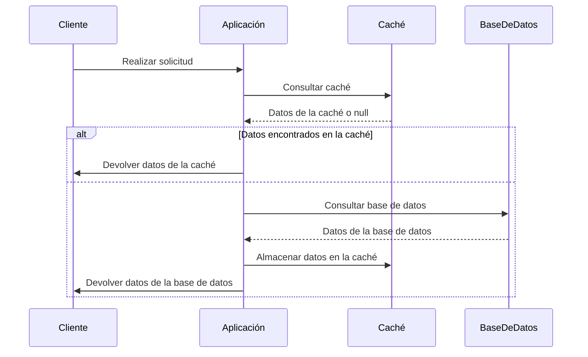

El principio "Use Caching" (Utiliza Caché) es una guía de diseño que sugiere el uso de la caché como una estrategia para mejorar el rendimiento y la eficiencia de una aplicación. La caché es una memoria temporal que almacena copias de datos que se acceden con frecuencia, de modo que se puedan recuperar rápidamente sin tener que volver a obtenerlos de la fuente original.

A continuación, se presentan algunas recomendaciones para aplicar el principio "Use Caching":

1. Identificar datos frecuentemente accedidos: Analiza tu aplicación y determina qué datos se acceden con mayor frecuencia y tienen un impacto significativo en el rendimiento. Estos datos son buenos candidatos para ser almacenados en caché.

2. Diseñar una estrategia de caché: Define una estrategia clara sobre qué datos se deben almacenar en caché, cómo se deben almacenar y durante cuánto tiempo. Considera el equilibrio entre el costo de almacenamiento en caché y los beneficios de rendimiento que proporciona.

3. Utilizar el almacenamiento en caché en capas: Puedes implementar múltiples capas de caché, desde una caché local en memoria hasta una caché distribuida a nivel de red. Esto te permite aprovechar diferentes niveles de caché según las necesidades y la escala de tu aplicación.

4. Actualizar la caché de manera coherente: Cuando los datos originales cambien, asegúrate de actualizar la caché correspondiente para reflejar los cambios. Utiliza técnicas como la invalidación de caché o la actualización programada para mantener la coherencia de los datos.

5. Configurar políticas de expiración y evicción: Establece tiempos de expiración para los datos en caché y define políticas de evicción para eliminar los datos menos utilizados cuando la caché alcanza su capacidad máxima. Esto ayuda a garantizar que la caché contenga datos actualizados y relevantes.

6. Considerar la consistencia de datos: Si los datos en tu aplicación requieren una alta consistencia, asegúrate de utilizar una caché coherente que actualice automáticamente los datos en caché cuando se realicen cambios.

7. Realizar pruebas de rendimiento: Realiza pruebas exhaustivas para medir el impacto del uso de la caché en el rendimiento de tu aplicación. Ajusta la configuración de la caché y realiza optimizaciones según los resultados obtenidos.

El uso adecuado de la caché puede mejorar significativamente el rendimiento de una aplicación al reducir la latencia de acceso a datos y disminuir la carga en los recursos de almacenamiento y procesamiento. Sin embargo, es importante tener en cuenta que la caché debe utilizarse de manera cuidadosa y coherente, y adaptarse a las necesidades y características específicas de tu aplicación.

## Recomendaciones

1. Analiza y comprende tus patrones de acceso a datos: Identifica los datos que se acceden con mayor frecuencia y que pueden beneficiarse del almacenamiento en caché. Examina los patrones de lectura y escritura de datos en tu aplicación para determinar qué datos son adecuados para ser almacenados en caché.

2. Define una estrategia de caché adecuada: Determina qué tipo de caché es más apropiado para tu aplicación. Puedes optar por una caché en memoria, una caché basada en disco o una caché distribuida según tus necesidades de rendimiento, escalabilidad y consistencia de datos.

3. Establece políticas de expiración y actualización: Define tiempos de expiración para los datos en caché para garantizar que se actualicen periódicamente desde la fuente original. Considera utilizar técnicas como la invalidación de caché basada en tiempo, eventos o cambios en los datos subyacentes.

4. Utiliza algoritmos de evicción eficientes: Si la capacidad de la caché se ve limitada, es importante contar con algoritmos de evicción adecuados para eliminar los datos menos utilizados y dar espacio a nuevos datos. Algunos algoritmos populares incluyen LRU (Least Recently Used), LFU (Least Frequently Used) o ARC (Adaptive Replacement Cache).

5. Evita la sobreexposición de la caché: Limita el acceso directo a la caché desde diferentes partes de tu aplicación. En su lugar, utiliza una capa de abstracción o un componente de caché centralizado para controlar el acceso y la gestión de la caché de manera coherente.

6. Monitorea y mide el rendimiento de la caché: Implementa métricas y herramientas de monitoreo para evaluar el impacto del almacenamiento en caché en el rendimiento de tu aplicación. Realiza pruebas de carga y realiza ajustes en la configuración de la caché según sea necesario.

7. Considera la consistencia y coherencia de los datos: Evalúa las necesidades de consistencia de tus datos y selecciona la estrategia de caché adecuada. Si la coherencia de los datos es crítica, considera utilizar técnicas como cachés coherentes distribuidas (como Redis) o invalidación de caché basada en eventos.

8. Realiza pruebas exhaustivas: Antes de implementar el almacenamiento en caché en un entorno de producción, realiza pruebas exhaustivas para asegurarte de que la caché funcione correctamente y mejore el rendimiento de tu aplicación. Realiza pruebas de estrés y pruebas de carga para evaluar el comportamiento de la caché en situaciones de alto tráfico.

Recuerda que el uso de la caché no es una solución universal y debe aplicarse de manera cuidadosa y considerando las características específicas de tu aplicación. Evalúa regularmente el rendimiento de la caché y realiza ajustes según sea necesario para mantener un equilibrio óptimo entre el rendimiento y la consistencia de datos.

## Ejemplo

En este diagrama de secuencia, se muestra la interacción entre el cliente, la aplicación, la caché y la base de datos. 

1. El cliente realiza una solicitud a la aplicación.
2. La aplicación consulta la caché para verificar si los datos solicitados están almacenados en ella.
3. Si los datos se encuentran en la caché, se devuelven a la aplicación y luego al cliente.
4. Si los datos no están en la caché, la aplicación realiza una consulta a la base de datos.
5. La base de datos responde con los datos solicitados.
6. La aplicación almacena los datos en la caché para su uso futuro.
7. Finalmente, la aplicación devuelve los datos al cliente.

Este diagrama de secuencia ilustra cómo se utiliza la caché para evitar consultas innecesarias a la base de datos y mejorar el rendimiento de la aplicación.