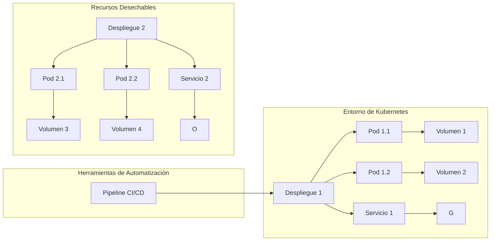

El principio "Use Disposable Resources" se refiere al enfoque de utilizar recursos desechables en la arquitectura de la nube. Consiste en diseñar y construir sistemas de manera que los recursos, como instancias de servidores, contenedores, bases de datos, entre otros, puedan ser fácilmente creados, destruidos y reemplazados según sea necesario.

El uso de recursos desechables proporciona una serie de beneficios en la arquitectura de la nube:

1. Eficiencia en costos: Los recursos desechables permiten aprovechar la escalabilidad horizontal y vertical, lo que significa que puedes aumentar o reducir la capacidad según la demanda. Al utilizar recursos solo cuando son necesarios y eliminarlos cuando ya no se necesitan, se evita incurrir en costos innecesarios.

2. Agilidad y flexibilidad: Al poder crear y destruir recursos de manera rápida y sencilla, se obtiene una mayor agilidad en la implementación y adaptación del sistema. Esto permite responder rápidamente a cambios en los requisitos o en la carga de trabajo, y facilita la realización de pruebas, experimentos y despliegues frecuentes.

3. Facilidad en la gestión y mantenimiento: Al utilizar recursos desechables, se minimiza la complejidad de la administración y el mantenimiento a largo plazo. Los recursos pueden ser creados a partir de plantillas predefinidas y configuraciones automatizadas, lo que garantiza una mayor consistencia y reduce el esfuerzo requerido para la administración.

4. Tolerancia a fallos: Al utilizar recursos desechables, el sistema se vuelve más tolerante a fallos. Si un recurso falla, puede ser reemplazado rápidamente por uno nuevo sin afectar significativamente la disponibilidad del sistema. Esto permite una mayor resiliencia y capacidad de recuperación.

Para aplicar el principio "Use Disposable Resources" en la arquitectura de la nube, aquí tienes algunas recomendaciones:

1. Utiliza herramientas de aprovisionamiento y gestión de recursos: Utiliza herramientas como Terraform, Ansible o CloudFormation para definir y aprovisionar recursos de manera programática. Esto permite crear y configurar recursos de forma automatizada y reproducible.

2. Utiliza contenedores: Los contenedores, como Docker, proporcionan un medio eficiente y portátil para empaquetar aplicaciones y sus dependencias. Los contenedores son fácilmente desplegables y pueden ser creados y destruidos rápidamente según sea necesario.

3. Implementa la automatización del ciclo de vida de los recursos: Utiliza pipelines de CI/CD y scripts de automatización para crear, configurar y destruir recursos de manera controlada. Esto asegura que los recursos sean desplegados de manera consistente y que se puedan eliminar de forma segura cuando ya no sean necesarios.

4. Utiliza servicios gestionados: Aprovecha los servicios gestionados ofrecidos por los proveedores de la nube. Estos servicios, como bases de datos gestionadas o servicios de mensajería, permiten utilizar recursos desechables sin tener que preocuparte por la administración y el mantenimiento a nivel de infraestructura.

5. Diseña la arquitectura para la resiliencia: Considera la posibilidad de fallos en tus recursos y diseña la arquitectura de tu sistema de manera que sea capaz de recuperarse de forma autom

ática y rápida. Esto puede incluir la utilización de grupos de escalado automático o la replicación de recursos.

Recuerda que el uso de recursos desechables implica un enfoque diferente en comparación con la gestión tradicional de recursos. Es importante comprender y tener en cuenta los costos asociados con la creación y destrucción de recursos, así como garantizar una correcta gestión y configuración para evitar fugas de recursos o ineficiencias.

## Recomendaciones

Si estás utilizando Kubernetes como plataforma de orquestación de contenedores en la nube, aquí tienes algunas recomendaciones para aplicar el principio "Use Disposable Resources" específicamente en este contexto:

1. Utiliza implementaciones declarativas: En lugar de realizar cambios directamente en los recursos en ejecución, utiliza archivos de configuración YAML o JSON para describir el estado deseado de tus recursos de Kubernetes, como pods, servicios y despliegues. Esto permite que los recursos sean fácilmente reemplazables y replicables.

2. Implementa despliegues y réplicas: Utiliza el objeto Deployment de Kubernetes para administrar tus aplicaciones. Los despliegues permiten definir el estado deseado y Kubernetes se encarga de crear y destruir réplicas automáticamente para mantener ese estado. Esto facilita la escalabilidad y la recuperación ante fallos.

3. Utiliza volúmenes y almacenamiento persistente: Para almacenar datos persistentes, utiliza volúmenes y almacenamiento persistente en Kubernetes. Al separar los datos del ciclo de vida de los contenedores, puedes eliminar y recrear los contenedores sin perder los datos almacenados. Esto permite una mayor flexibilidad y agilidad en el manejo de recursos.

4. Aprovecha los servicios de escalado automático: Kubernetes proporciona la funcionalidad de escalado automático horizontal, lo que significa que puede ajustar automáticamente el número de réplicas de tus aplicaciones en función de la demanda. Aprovecha esta funcionalidad para escalar hacia arriba o hacia abajo según sea necesario, utilizando recursos desechables.

5. Utiliza políticas de reinicio y tolerancia a fallos: Configura las políticas de reinicio y tolerancia a fallos en Kubernetes para garantizar la disponibilidad continua de tus aplicaciones. Puedes establecer políticas de reinicio para que Kubernetes vuelva a intentar iniciar un contenedor si falla, o configurar tolerancia a fallos para que Kubernetes reemplace automáticamente los contenedores que fallan.

6. Implementa pipelines de CI/CD para despliegue automatizado: Utiliza pipelines de integración y entrega continua (CI/CD) para automatizar el proceso de construcción, prueba y despliegue de tus aplicaciones en Kubernetes. Esto te permite crear y destruir recursos desechables de manera controlada durante el ciclo de vida de tu aplicación.

7. Realiza pruebas y validaciones regulares: Asegúrate de realizar pruebas y validaciones regulares de tus aplicaciones en Kubernetes. Esto incluye pruebas unitarias, pruebas de integración y pruebas de estrés para asegurarte de que tus recursos desechables funcionen correctamente y cumplan con los requisitos de tu aplicación.

Recuerda monitorear y gestionar adecuadamente los recursos en Kubernetes para evitar posibles fugas o ineficiencias que puedan afectar el rendimiento y los costos. Mantener un equilibrio entre la escalabilidad y la eficiencia de los recursos desechables es fundamental para aprovechar al máximo Kubernetes y el principio "Use Disposable Resources".

## Ejemplo
Ejemplo de diagrama para ilustrar un escenario en Kubernetes aplicando el principio "Use Disposable Resources":

En este ejemplo, se muestra un entorno de Kubernetes donde se aplican recursos desechables y automatización mediante un pipeline de CI/CD. Aquí tienes una descripción de cada componente:

- El "Entorno de Kubernetes" representa un clúster de Kubernetes donde se despliegan las aplicaciones.
- "Despliegue 1" es un despliegue inicial con dos pods (Pod 1.1 y Pod 1.2) y un servicio (Servicio 1). También se incluyen volúmenes (Volumen 1 y Volumen 2) para almacenamiento persistente si es necesario.
- "Herramientas de Automatización" representa un pipeline de CI/CD que se encarga de implementar y gestionar los recursos en Kubernetes.
- "Recursos Desechables" muestra otro despliegue (Despliegue 2) con dos pods (Pod 2.1 y Pod 2.2) y un servicio (Servicio 2). También se incluyen volúmenes (Volumen 3 y Volumen 4) para almacenamiento persistente si es necesario.

En este escenario, el pipeline de CI/CD (representado por "Herramientas de Automatización") es responsable de crear y gestionar los despliegues y los recursos en Kubernetes. Permite la fácil creación, actualización y eliminación de recursos desechables, como pods y servicios.

Ten en cuenta que este es solo un ejemplo básico y que puedes personalizar y ampliar el diagrama según tus necesidades y configuraciones específicas en Kubernetes.

Recuerda que Mermaid es una herramienta flexible para la creación de diagramas y puedes explorar más opciones y elementos para representar de manera efectiva tu arquitectura de Kubernetes y el principio "Use Disposable Resources".