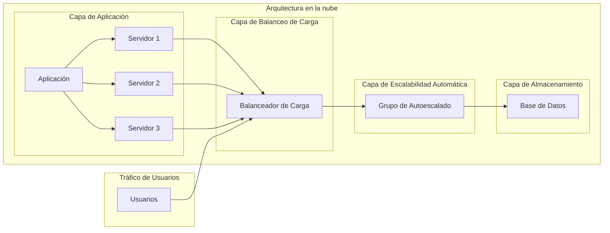

El principio de arquitectura "Enable Scalability" se refiere a la capacidad de una arquitectura en la nube para escalar de manera eficiente y flexible para satisfacer las demandas cambiantes de recursos. La escalabilidad es esencial en los entornos de computación en la nube, ya que permite que los sistemas se adapten a cargas de trabajo variables, desde picos de tráfico hasta aumentos en la demanda de recursos.

Hay dos tipos principales de escalabilidad: escalabilidad vertical y escalabilidad horizontal.

La escalabilidad vertical implica aumentar los recursos de hardware dentro de una sola instancia o servidor, como agregar más potencia de procesamiento, memoria o capacidad de almacenamiento. Esto puede lograrse a través de la actualización o el reemplazo de componentes físicos en el servidor.

Por otro lado, la escalabilidad horizontal implica agregar más instancias o servidores a la arquitectura para distribuir la carga de trabajo. Esto se logra mediante la adición de más nodos a un clúster o mediante la duplicación de instancias de servidores virtuales.

La arquitectura en la nube debe ser diseñada de manera que permita una fácil escalabilidad, lo que implica considerar varios aspectos:

1. Diseño modular: La arquitectura debe estar compuesta por módulos independientes y desacoplados, lo que permite que cada componente se pueda escalar de forma independiente según sea necesario.

2. Autoescalado: Se deben implementar políticas de autoescalado que monitoreen las métricas de rendimiento, como la carga de CPU o la utilización de la memoria, y agreguen o eliminen automáticamente recursos según los umbrales predefinidos.

3. Balanceo de carga: La distribución equitativa de la carga de trabajo entre las instancias escalables es esencial para garantizar un rendimiento óptimo. El balanceo de carga se puede lograr mediante el uso de enrutadores o controladores de carga que distribuyen las solicitudes de manera eficiente.

4. Elasticidad: La capacidad de agregar o eliminar recursos de manera dinámica y automática en función de la demanda. Esto permite que la arquitectura se expanda o contraiga según sea necesario para mantener un rendimiento óptimo sin intervención manual.

5. Servicios gestionados: El uso de servicios gestionados de la nube, como bases de datos o sistemas de almacenamiento, puede simplificar la escalabilidad al permitir que los proveedores de la nube administren la infraestructura subyacente y realicen las tareas de escalado de forma transparente.

En resumen, el principio de arquitectura "Enable Scalability" se centra en diseñar y desarrollar arquitecturas en la nube que puedan escalar de manera eficiente y flexible para adaptarse a las demandas cambiantes de recursos. Esto se logra a través del diseño modular, el autoescalado, el balanceo de carga, la elasticidad y el uso de servicios gestionados. Al habilitar la escalabilidad, las aplicaciones y servicios en la nube pueden adaptarse a cargas de trabajo variables y mantener un rendimiento óptimo en todo momento.

## Recomendaciones

1. Diseño modular y desacoplado: Divide tu arquitectura en componentes independientes y desacoplados. Utiliza servicios y microservicios para encapsular la funcionalidad específica y permitir que cada componente se pueda escalar de forma independiente según sea necesario.

2. Utiliza servicios gestionados: Aprovecha los servicios gestionados de la nube, como bases de datos, colas de mensajes y sistemas de almacenamiento. Estos servicios se encargan de la administración y escalado subyacente, lo que te permite centrarte en el desarrollo de tu aplicación sin preocuparte por la infraestructura.

3. Implementa políticas de autoescalado: Configura políticas de autoescalado para monitorear las métricas relevantes, como la carga de CPU, la utilización de memoria o el tráfico de red. Define umbrales de escalado para agregar o eliminar automáticamente instancias o recursos según la demanda.

4. Diseña para la resiliencia: Asegúrate de que tu arquitectura pueda manejar fallas y recuperarse de manera automática. Utiliza técnicas como la replicación de instancias y la distribución de carga para garantizar que los fallos no afecten negativamente el rendimiento y la disponibilidad del sistema.

5. Aplica el principio de "Infrastructure as Code" (Infraestructura como Código): Utiliza herramientas de administración de configuración y orquestación, como Terraform o Ansible, para describir tu infraestructura como código. Esto facilita la creación y configuración de recursos escalables y reproducebles de manera consistente.

6. Implementa balanceo de carga: Utiliza balanceadores de carga para distribuir la carga de trabajo entre las instancias escalables. Esto garantiza que los recursos se utilicen de manera eficiente y que los usuarios experimenten un rendimiento óptimo.

7. Monitorea y ajusta constantemente: Realiza un seguimiento de las métricas clave de rendimiento y capacidad de tu arquitectura en la nube. Utiliza herramientas de monitoreo y registros para identificar cuellos de botella y realizar ajustes según sea necesario.

8. Prueba el escalado: Realiza pruebas de carga y estrés para validar que tu arquitectura puede escalar correctamente y manejar cargas de trabajo intensivas. Esto te permitirá identificar posibles problemas de rendimiento o configuración antes de implementar en producción.

Recuerda que cada arquitectura y aplicación en la nube es única, por lo que es importante adaptar estas recomendaciones a tus necesidades y requisitos específicos. Además, mantente actualizado con las mejores prácticas y las últimas tecnologías en la nube, ya que el campo de la computación en la nube está en constante evolución.

## Ejemplo

A continuación te presento un ejemplo de un diagrama para ilustrar un diseño de arquitectura en la nube escalable:

En este ejemplo, tenemos una arquitectura en la nube compuesta por una capa de aplicación que consta de tres servidores (Servidor 1, Servidor 2 y Servidor 3) que alojan la aplicación. Estos servidores están conectados a un balanceador de carga (Balanceador de Carga) que distribuye la carga de trabajo de manera equitativa entre ellos.

La capa de escalabilidad automática (Grupo de Autoescalado) supervisa las métricas de rendimiento y ajusta automáticamente la cantidad de servidores según la demanda. Si la carga aumenta, se agregarán instancias adicionales para manejarla, y si la carga disminuye, se reducirá el número de instancias.

Por último, la capa de almacenamiento está representada por una base de datos (Base de Datos) que se encuentra conectada al grupo de autoescalado. Esto asegura que las instancias adicionales de la aplicación tengan acceso a la misma base de datos y puedan mantener la coherencia de los datos.

El tráfico de usuarios (Usuarios) se dirige al balanceador de carga, que luego distribuye las solicitudes a los servidores disponibles en función de la carga y la configuración del balanceo de carga.

Este ejemplo ilustra cómo se puede implementar la escalabilidad en una arquitectura en la nube utilizando Mermaid para representar el diseño.