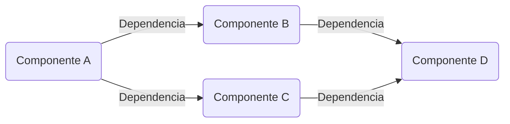

El principio "Loosely Couple Your Components" (Acoplar los componentes de forma flexible) es un principio de diseño de software que promueve la independencia y la baja interdependencia entre los componentes de un sistema. Este principio busca reducir la interacción directa y la dependencia entre los componentes, lo cual mejora la flexibilidad, la mantenibilidad y la escalabilidad del sistema.

Al aplicar este principio, los componentes del sistema deben comunicarse entre sí a través de interfaces bien definidas y desacopladas. Algunas recomendaciones para lograr un acoplamiento flexible son:

1. Definir interfaces claras: Los componentes deben comunicarse a través de interfaces bien definidas y documentadas. Estas interfaces deben ser estables y no deben cambiar con frecuencia para evitar romper la compatibilidad con otros componentes.

2. Evitar dependencias directas: Los componentes deben depender de abstracciones en lugar de implementaciones concretas. Esto se logra utilizando patrones como la inversión de control (IoC) y la inyección de dependencias (DI), que permiten desacoplar los componentes al pasar las dependencias a través de interfaces en lugar de crearlas directamente dentro del componente.

3. Minimizar el acoplamiento temporal: El acoplamiento temporal se refiere a la dependencia entre componentes en relación con el tiempo de ejecución. Es importante evitar situaciones en las que un componente dependa del estado o el comportamiento de otro componente en un momento específico. En su lugar, se debe utilizar la comunicación a través de mensajes o eventos para lograr una comunicación asincrónica y evitar dependencias temporales.

4. Utilizar estándares y protocolos abiertos: Al utilizar estándares y protocolos abiertos, se facilita la interoperabilidad entre los componentes. Esto permite que diferentes componentes desarrollados por diferentes equipos o proveedores se comuniquen de manera eficiente y sin problemas.

5. Aplicar el principio de responsabilidad única: Cada componente debe tener una responsabilidad clara y estar enfocado en realizar una tarea específica. Esto ayuda a evitar la mezcla de lógica y funcionalidad en un único componente, lo que facilita su reutilización y evita la propagación de cambios en todo el sistema.

Al aplicar el principio "Loosely Couple Your Components", se logra un sistema más flexible, mantenible y escalable. Los componentes pueden ser modificados, reemplazados o actualizados sin afectar a otros componentes, lo que facilita la evolución y la adaptación del sistema a medida que cambian los requisitos y las necesidades del negocio.

## Recomendaciones 

1. Definir interfaces claras y estables: Es fundamental establecer interfaces bien definidas entre los componentes. Estas interfaces deben ser estables y no sufrir cambios frecuentes, de manera que los componentes que dependen de ellas no se vean afectados. Además, las interfaces deben ser documentadas de manera clara y accesible para todos los equipos involucrados.

2. Utilizar la inversión de control (IoC) y la inyección de dependencias (DI): Estos patrones de diseño permiten desacoplar los componentes, ya que las dependencias se proporcionan a través de interfaces en lugar de ser creadas directamente dentro de los componentes. Esto facilita la modificación y el reemplazo de las dependencias, así como la prueba unitaria de los componentes de forma aislada.

3. Minimizar las dependencias directas: Es recomendable evitar las dependencias directas entre los componentes. En su lugar, se deben utilizar abstracciones y capas intermedias que actúen como interfaces entre los componentes. Esto permite que los componentes dependan de interfaces y no de implementaciones concretas, lo cual facilita la sustitución de componentes y promueve la modularidad.

4. Utilizar comunicación asincrónica: En lugar de tener una comunicación directa y sincrónica entre componentes, se recomienda utilizar comunicación asincrónica a través de mensajes o eventos. Esto permite que los componentes actúen de forma independiente y se acoplen de manera flexible. Además, facilita la escalabilidad y la tolerancia a fallos, ya que los componentes pueden procesar mensajes en paralelo y recuperarse de errores de manera más eficiente.

5. Aplicar el principio de responsabilidad única: Cada componente debe tener una responsabilidad clara y estar enfocado en realizar una tarea específica. Esto evita la mezcla de lógica y funcionalidad en un solo componente, lo cual facilita su comprensión, reutilización y mantenibilidad. Además, al tener componentes con responsabilidades únicas, se evita la propagación de cambios y se mejora la modularidad del sistema.

6. Utilizar estándares y protocolos abiertos: El uso de estándares y protocolos abiertos favorece la interoperabilidad entre componentes y sistemas. Esto permite que diferentes componentes desarrollados por diferentes equipos o proveedores se comuniquen de manera eficiente y sin problemas. Además, el uso de estándares abiertos promueve la reutilización de componentes y la integración con otras soluciones.

Al seguir estas recomendaciones, se logra un acoplamiento flexible entre los componentes del sistema, lo cual mejora la modularidad, la mantenibilidad y la escalabilidad del sistema. Además, se facilita la evolución y la adaptación del sistema a medida que cambian los requisitos y las necesidades del negocio.

## Ejemplo

El principio "Loosely Couple Your Components" (Acoplar los componentes de forma flexible) se puede representar visualmente utilizando la herramienta Mermaid. A continuación, se muestra un diagrama de flujo que ilustra la idea principal del principio:

En este diagrama, los componentes A, B, C y D están representados como nodos, y las flechas indican las dependencias entre ellos. Cada flecha representa una dependencia directa entre dos componentes.

El principio de acoplar los componentes de forma flexible se refleja en la estructura del diagrama. En lugar de tener un acoplamiento fuerte, donde los componentes dependen directamente unos de otros, se busca un acoplamiento débil mediante la introducción de dependencias indirectas y mecanismos de comunicación flexibles.

Por ejemplo, en el diagrama, el componente A depende de los componentes B y C, pero en lugar de depender directamente de ellos, se establece una dependencia indirecta a través de las flechas. Esto permite que el componente A sea independiente de las implementaciones concretas de B y C, y facilita la sustitución y modificación de los componentes sin afectar a los demás.

Del mismo modo, el componente D es dependiente de B y C, pero nuevamente se establecen dependencias indirectas en lugar de acoplamientos directos. Esto permite que D funcione de manera flexible con diferentes implementaciones de B y C, y facilita la modularidad y la evolución del sistema.

En resumen, el diagrama de flujo representa visualmente el principio de acoplar los componentes de forma flexible, mostrando las dependencias indirectas y promoviendo un acoplamiento débil y una comunicación flexible entre los componentes del sistema.