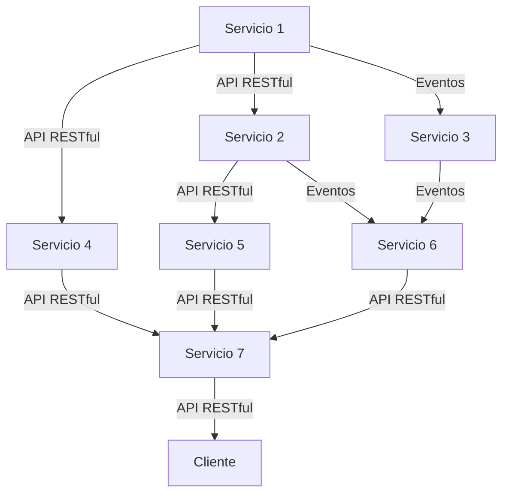

El principio "Design Services, No Servers" (Diseñar servicios, no servidores) es un enfoque de arquitectura en el desarrollo de aplicaciones que se basa en la creación de servicios independientes y desacoplados en lugar de depender de servidores monolíticos. Este enfoque se alinea con la arquitectura de microservicios, donde una aplicación se descompone en componentes más pequeños y autónomos que se comunican entre sí a través de interfaces bien definidas.

Aquí hay algunas características clave y beneficios asociados con este principio:

1. Desacoplamiento: Al diseñar servicios en lugar de servidores, se logra un alto nivel de desacoplamiento entre los diferentes componentes de una aplicación. Cada servicio se puede desarrollar, implementar y escalar de forma independiente, lo que permite cambios y actualizaciones más rápidas sin afectar a otros servicios.

2. Escalabilidad y rendimiento: Los servicios pueden escalar de manera independiente según sea necesario para satisfacer las demandas cambiantes de la aplicación. Esto permite un mejor rendimiento y una capacidad de respuesta mejorada, ya que cada servicio puede adaptarse a su carga de trabajo específica.

3. Mantenibilidad: Al separar la lógica y la funcionalidad en servicios individuales, el mantenimiento y la depuración se vuelven más manejables. Los problemas o actualizaciones en un servicio no tienen un impacto directo en otros servicios, lo que facilita la identificación y resolución de problemas.

4. Flexibilidad tecnológica: Al diseñar servicios independientes, tienes la libertad de utilizar diferentes tecnologías y lenguajes de programación que mejor se adapten a las necesidades específicas de cada servicio. Esto te permite aprovechar las fortalezas de cada tecnología sin estar limitado a una única pila tecnológica para toda la aplicación.

5. Reutilización: Los servicios pueden ser diseñados de manera que sean reutilizables en diferentes aplicaciones o contextos. Esto promueve la modularidad y facilita la integración con otras aplicaciones o sistemas, lo que lleva a un desarrollo más rápido y eficiente.

6. Tolerancia a fallos: Al diseñar servicios que se comunican a través de interfaces, se puede implementar una mayor tolerancia a fallos. Si un servicio falla, otros servicios aún pueden funcionar y proporcionar funcionalidad básica, evitando la interrupción completa de la aplicación.

En resumen, el principio "Design Services, No Servers" se basa en la idea de construir aplicaciones como un conjunto de servicios independientes en lugar de depender de servidores monolíticos. Este enfoque ofrece beneficios como desacoplamiento, escalabilidad, mantenibilidad y flexibilidad tecnológica, lo que resulta en aplicaciones más robustas y adaptables a medida que evolucionan las necesidades del negocio.

## Recomendaciones

Al aplicar el principio "Design Services, No Servers" en el desarrollo de aplicaciones, aquí tienes algunas recomendaciones para tener en cuenta:

1. Identificar límites de dominio y responsabilidades: Analiza y divide la lógica de negocio en servicios basados en los límites de dominio y las responsabilidades de cada componente. Esto ayuda a definir claramente las funciones y las interacciones entre los servicios.

2. Diseñar interfaces claras: Define interfaces bien definidas y claras para cada servicio. Esto incluye el uso de contratos y protocolos de comunicación estándar, como APIs RESTful o eventos basados en mensajes. Las interfaces deben ser consistentes y fáciles de entender para facilitar la interoperabilidad entre los servicios.

3. Desarrollar servicios independientes: Cada servicio debe ser autónomo y desarrollado de manera independiente. Esto significa que cada servicio debe tener su propio código fuente, repositorio y ciclo de vida de desarrollo. Evita compartir bases de código o dependencias innecesarias entre los servicios.

4. Utilizar contenedores y orquestadores: Considera el uso de contenedores, como Docker, para empaquetar y distribuir los servicios de manera independiente. Además, utiliza orquestadores como Kubernetes para administrar y escalar los servicios de manera eficiente.

5. Aplicar principios de diseño sólidos: Utiliza principios de diseño de software como la cohesión, el acoplamiento mínimo y la responsabilidad única al desarrollar los servicios. Esto promueve la modularidad y facilita el mantenimiento y la evolución de los servicios.

6. Establecer políticas de gestión de errores y fallas: Define políticas claras para la gestión de errores y fallas en los servicios. Esto incluye estrategias de manejo de excepciones, monitoreo de salud de los servicios y mecanismos de recuperación ante fallas.

7. Implementar pruebas automatizadas: Aplica pruebas unitarias, pruebas de integración y pruebas de aceptación automatizadas para garantizar la calidad de los servicios y la interoperabilidad entre ellos. Esto ayuda a detectar problemas tempranos y asegurar la estabilidad del sistema.

8. Considerar la seguridad: Asegúrate de implementar medidas de seguridad adecuadas en cada servicio, como autenticación y autorización, cifrado de datos y protección contra ataques comunes.

9. Documentar y comunicar: Documenta claramente la arquitectura y el diseño de los servicios, incluyendo las interfaces, las dependencias y las políticas de comunicación. Comunica estas decisiones a todo el equipo de desarrollo y a otros stakeholders relevantes.

10. Evaluar el rendimiento y la escalabilidad: Realiza pruebas de rendimiento y escalabilidad para identificar cuellos de botella y asegurarte de que los servicios pueden manejar la carga esperada. Ajusta y optimiza los servicios según sea necesario.

Recuerda que la implementación exitosa del principio "Design Services, No Servers" requiere un enfoque cuidadoso y una planificación adecuada. Es importante comprender las necesidades específicas del proyecto y adaptar estas recomendaciones según el contexto y los requisitos técnicos.

## Ejemplo

En este diagrama, cada caja representa un servicio independiente. Las flechas indican la comunicación entre los servicios a través de API RESTful o eventos. El servicio final se comunica con un cliente externo.

Este diagrama ilustra cómo los servicios se comunican entre sí utilizando interfaces bien definidas en lugar de depender de un servidor centralizado. Cada servicio tiene su propia responsabilidad y se comunica con otros servicios a través de interfaces claras y estándar.

Recuerda que esta es una representación conceptual y que la implementación real puede variar dependiendo del contexto y las tecnologías utilizadas.