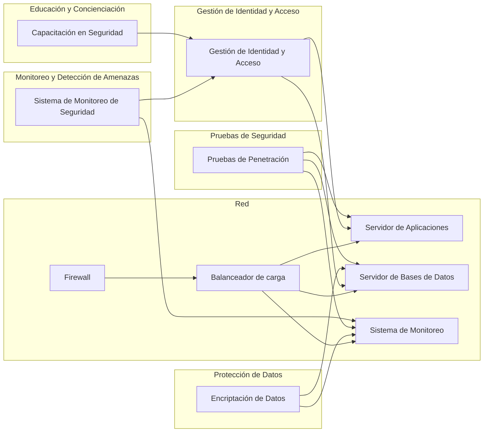

El principio "Secure Your Infrastructure Everywhere" se refiere a la importancia de implementar medidas de seguridad en todos los niveles de tu infraestructura, desde la red hasta las aplicaciones, para garantizar la protección de los datos y la prevención de ataques cibernéticos. El objetivo es asegurar que tu infraestructura sea resistente a amenazas y cumpla con los requisitos de seguridad.

Aquí tienes algunos aspectos clave y recomendaciones para aplicar este principio:

1. Seguridad en la red: Implementa medidas de seguridad en la capa de red para proteger tu infraestructura contra amenazas externas. Esto puede incluir firewalls, sistemas de detección y prevención de intrusiones (IDS/IPS), segmentación de red, configuración de acceso seguro y encriptación de comunicaciones.

2. Gestión de identidad y acceso: Establece un sistema de gestión de identidad y acceso robusto. Utiliza autenticación de múltiples factores (MFA), políticas de contraseñas seguras, control de acceso basado en roles (RBAC) y asegúrate de revocar los privilegios de acceso de usuarios que ya no los necesitan.

3. Protección de datos: Implementa mecanismos de protección de datos para garantizar la confidencialidad y la integridad de la información sensible. Esto puede incluir encriptación de datos en reposo y en tránsito, técnicas de ofuscación, control de acceso granular a los datos y copias de seguridad regulares.

4. Seguridad en las aplicaciones: Asegúrate de que tus aplicaciones estén protegidas contra vulnerabilidades y ataques comunes. Realiza pruebas de seguridad, como pruebas de penetración, para identificar posibles puntos débiles. Utiliza soluciones de seguridad de aplicaciones, como firewalls de aplicaciones web (WAF) y escaneo de código fuente, para mitigar riesgos.

5. Monitoreo y detección de amenazas: Implementa sistemas de monitoreo de seguridad para detectar y responder rápidamente a posibles amenazas y ataques. Utiliza herramientas de análisis de registros y eventos, así como soluciones de detección de intrusiones, para identificar patrones de comportamiento malicioso y anomalías en tiempo real.

6. Actualizaciones y parches: Mantén tu infraestructura y tus aplicaciones actualizadas con los últimos parches de seguridad. Las actualizaciones y los parches suelen solucionar vulnerabilidades conocidas y mejoran la seguridad general del sistema.

7. Educación y concienciación: Fomenta una cultura de seguridad entre tu equipo y los usuarios de tu infraestructura. Capacita a tu personal en prácticas de seguridad cibernética, como la prevención de ataques de phishing, la gestión de contraseñas seguras y la identificación de amenazas potenciales.

8. Cumplimiento normativo: Asegúrate de cumplir con los requisitos legales y normativos en materia de seguridad cibernética que apliquen a tu industria. Esto puede incluir el cumplimiento de estándares como el Reglamento General de Protección de Datos (RGPD) o normas específicas de la industria, como la Norma de Seguridad de Datos para la Industria de Tarjetas de Pago (PCI DSS).

Al aplicar estas recomendaciones, estarás fortaleciendo la seguridad de tu infra

estructura en todos los niveles y reduciendo la probabilidad de violaciones de seguridad. La seguridad debe ser un aspecto integral de tu infraestructura en todos los aspectos, desde el diseño hasta la implementación y el mantenimiento continuo.

## Recomendaciones

Aquí tienes algunas recomendaciones para aplicar el principio "Secure Your Infrastructure Everywhere":

1. Evaluación de riesgos: Realiza una evaluación exhaustiva de los riesgos de seguridad en tu infraestructura. Identifica posibles vulnerabilidades y amenazas, y priorízalas según su impacto y probabilidad.

2. Políticas y estándares de seguridad: Establece políticas y estándares de seguridad claros que aborden los requisitos de seguridad en todos los niveles de tu infraestructura. Define reglas para el acceso seguro, el uso de contraseñas fuertes, la configuración segura de servidores y servicios, y otras prácticas recomendadas.

3. Seguridad en la red: Implementa firewalls, sistemas de detección y prevención de intrusiones (IDS/IPS) y otras medidas de seguridad en tu red. Configura reglas de firewall para permitir solo el tráfico necesario y cifra las comunicaciones sensibles.

4. Gestión de identidad y acceso: Utiliza una solución de gestión de identidad y acceso robusta para administrar y controlar los privilegios de los usuarios. Implementa autenticación de múltiples factores (MFA) y asegúrate de que se sigan las mejores prácticas de seguridad al establecer contraseñas.

5. Protección de datos: Implementa encriptación de datos tanto en reposo como en tránsito. Utiliza técnicas de ofuscación de datos cuando sea necesario. Asegúrate de que los datos se respalden regularmente y que los procedimientos de recuperación ante desastres estén en su lugar.

6. Pruebas de seguridad: Realiza pruebas de seguridad regulares, como pruebas de penetración y escaneos de vulnerabilidades, para identificar y abordar posibles vulnerabilidades en tu infraestructura. Realiza pruebas antes de implementar nuevas aplicaciones o realizar cambios importantes.

7. Monitoreo y detección de amenazas: Implementa sistemas de monitoreo y detección de amenazas para identificar actividades sospechosas y responder rápidamente a incidentes de seguridad. Utiliza herramientas de análisis de registros y eventos para detectar anomalías y establece alertas para notificar eventos de seguridad críticos.

8. Educación y concienciación: Proporciona capacitación regular sobre seguridad cibernética a tu personal y promueve una cultura de seguridad. Educa a los usuarios sobre las mejores prácticas de seguridad, como evitar el phishing y el uso seguro de contraseñas.

9. Mantenerse actualizado: Mantente al tanto de las últimas vulnerabilidades y amenazas de seguridad. Mantén tu infraestructura y tus aplicaciones actualizadas con los últimos parches de seguridad y actualizaciones.

10. Auditorías de seguridad: Realiza auditorías de seguridad periódicas para evaluar la efectividad de tus medidas de seguridad y identificar áreas de mejora. Realiza revisiones regulares de tu infraestructura para asegurarte de que se cumplan los estándares de seguridad.

Recuerda que la seguridad es un proceso continuo y dinámico. Debes estar preparado para adaptarte a las nuevas amenazas y actualizar tus medidas de seguridad en consecuencia.

## Ejemplo
Ejemplo de diagrama  para ilustrar un escenario en el que se aplica el principio "Secure Your Infrastructure Everywhere":

En este ejemplo, se muestra una infraestructura de TI con varios componentes de seguridad aplicados en diferentes niveles. Aquí tienes una descripción de cada componente:

- "Red" representa la infraestructura de red que incluye un firewall para proteger el tráfico entrante, un balanceador de carga para distribuir la carga entre los servidores y servidores de aplicaciones y bases de datos.

- "Gestión de Identidad y Acceso" se encarga de gestionar y controlar los privilegios de acceso de los usuarios. Garantiza que solo los usuarios autorizados puedan acceder a los servidores de aplicaciones y bases de datos.

- "Protección de Datos" muestra la encriptación de datos en los servidores de bases de datos y en el sistema de monitoreo. Esto asegura que los datos sensibles estén protegidos tanto en reposo como en tránsito.

- "Pruebas de Seguridad" representa las pruebas de penetración realizadas en los servidores de aplicaciones, bases de datos y el sistema de monitoreo. Estas pruebas ayudan a identificar vulnerabilidades y fortalecer la seguridad de la infraestructura.

- "Monitoreo y Detección de Amenazas" muestra el sistema de monitoreo de seguridad que supervisa el estado de la infraestructura y detecta posibles amenazas y actividades sospechosas. También está conectado a la gestión de identidad y acceso para detectar intentos de acceso no autorizados.

- "Educación y Concienciación" representa la capacitación en seguridad cibernética que se proporciona a los usuarios y el personal. Esto promueve una cultura de seguridad y conciencia sobre las mejores prácticas de seguridad.

Este diagrama ilustra cómo se pueden aplicar medidas de seguridad en diferentes niveles de la infraestructura para garantizar la protección en todas partes. Recuerda que este es solo un ejemplo básico y puedes personalizar y expandir el diagrama según tus propias configuraciones y requisitos específicos.