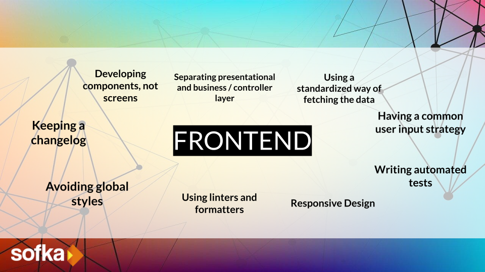

# Principios de Frontend

## ¿Porqué son importantes?

Los principios de frontend son importantes porque permiten desarrollar aplicaciones web con una experiencia de usuario consistente, eficiente y agradable. Un buen diseño de frontend permite que los usuarios puedan interactuar con la aplicación de manera intuitiva, reduciendo la curva de aprendizaje y mejorando la eficiencia en el uso. Además, un frontend bien estructurado y organizado permite un mantenimiento más sencillo y escalabilidad de la aplicación a medida que esta crece en complejidad y características. En resumen, los principios de frontend ayudan a crear aplicaciones web más efectivas, usables y escalables.