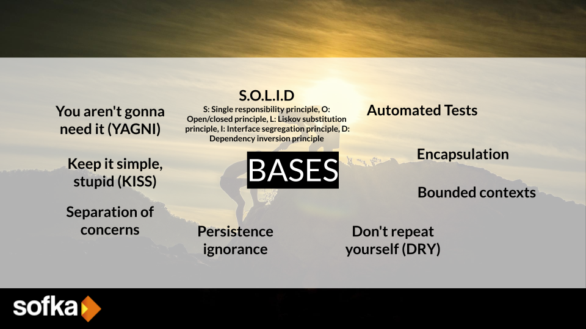
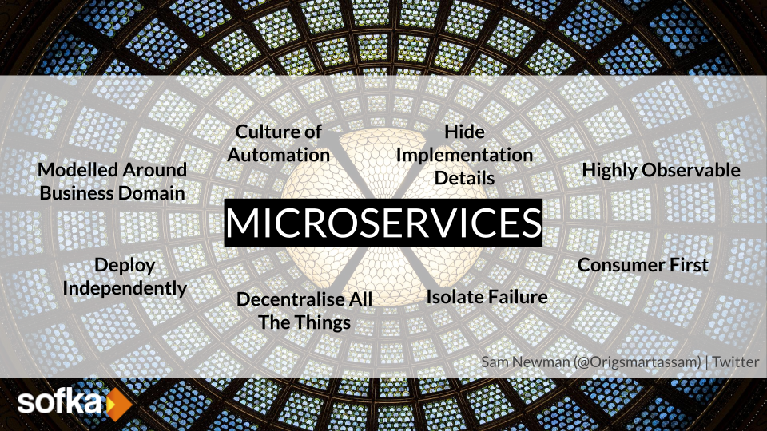
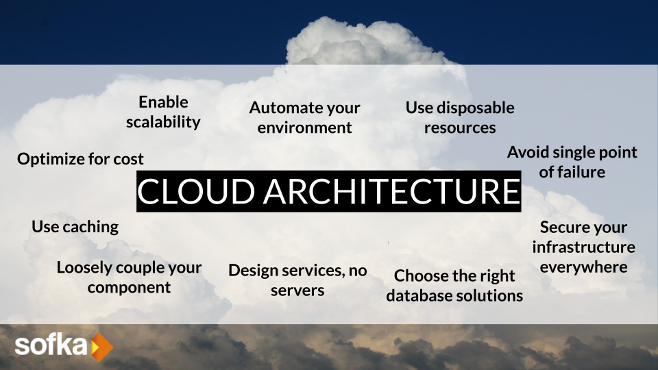

# Principios de Programación

Aprendamos todo lo relacionado a los principios de programación, en este documento será de guía para que usted pueda aplicar de manera conciente los principios y fundamentos de buenas practicas de programación.

## Recomendaciones

* Leer de manera conciente y participar en los debates asincronos
* Desarrollar los talleres propuestos 
* Buscar por tu cuenta mas información relacionado al tema tratado
* Retroalimentación del contenido expuesto

## Fundamentos

Los principios de programación son un conjunto de pautas y prácticas que se utilizan para escribir ***código limpio***, ***mantenible*** y ***eficiente***. Estos principios ayudan a los programadores a crear software de alta calidad que sea fácil de leer, modificar y extender.

La base de la mayoria de los principios son fundamentados con base a:

- **La simplicidad:** El código debe ser simple y fácil de entender. Esto hace que sea más fácil de mantener y reducir errores.

- **La modularidad:** El código debe ser dividido en módulos lógicos que realicen una sola tarea. Esto hace que sea más fácil de entender y modificar.

- **La reutilización:** El código debe ser diseñado para ser reutilizado en diferentes partes del programa. Esto ahorra tiempo y reduce la posibilidad de errores.

- **La legibilidad:** El código debe ser fácil de leer y entender para otros programadores. Esto hace que sea más fácil de mantener y mejorar.

- **La eficiencia:** El código debe ser escrito de tal manera que sea rápido y eficiente. Esto mejora el rendimiento del programa y reduce el tiempo de ejecución.

- **La consistencia:** El código debe seguir un estilo de codificación consistente en todo el programa. Esto hace que sea más fácil de leer y entender.

- **La escalabilidad:** El código debe ser diseñado para que pueda manejar grandes volúmenes de datos y procesamiento. Esto permite que el programa crezca y se adapte a las necesidades del usuario.

- **La seguridad:** El código debe ser diseñado para ser seguro y resistente a ataques externos. Esto evita que los datos sean robados o manipulados por hackers.

Estos son solo algunos de los principios de programación más importantes. Los programadores experimentados siempre intentan seguir estas prácticas para crear software de alta calidad.

## Principios bases de programación
Estos principios son fundamentales dentro del del enfoque de desarrollo de software, se aplica día a día durante la codificación. Parte de nuestra cultura de desarrollo deberíamos comprender estos principios.

## Principios de front end
Con estos principios nos orientados a diseñar soluciones frontend con capacidades de mantenibilidad y usabilidad. Es fundamentar comprender estos principios antes de abordar un desarrollo web, dado que posteriormente sería muy complejo adaptarlo o ajustarlo.

## Principios de arquitectura limpia
Con estos principios podemos definir arquitecturas de larga durabilidad, su enfoque es genérico y de uso práctico. Además de ser principios fundamentales son reglas que se deberían considerar de manera permanente durante todo el proceso de implementación de arquitectura. 

## Principios de microservicios
Con esta serie de principios nos ayuda a implementar microserivicios con alta capacidad de adaptación y cambio, gracias a estos principios el mantenimiento se hace mas facil de ejecutar.  

## Principios de arquitectura cloud
Estos principios son recomendados por AWS para optimizar y gestionar diferentes elementos de computo en la nube, ademas son recomendaciones para la implementación de diseños de arquitectura  desde diferetes modelo de servicios cloud.

